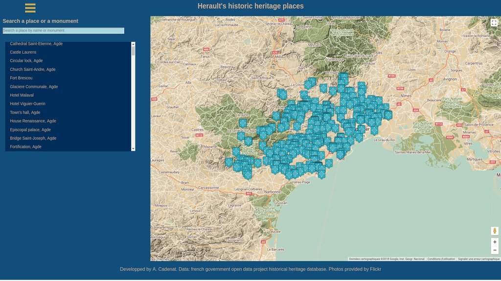
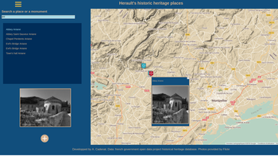
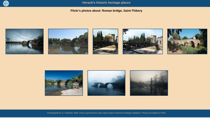

# Fend project #8 Neighborhood

## Description

The project show a map with markers on historical heritage places of Herault, a south of France territory.
The user can click on marker to display a pic coming from Flickr taken around that place. He also can show a sidebar with a text input and a list of the places.  
The list and the markers are shown in accordance of the places matching the query.

The project is responsive and usable on modern device and it passes [aXe](https://www.deque.com/axe/) accessiblity audit except 3 issues in Google map iframe where no corrective action can be taken.

A service worker is installed and a offline-first rendering is used allowing an offline use.

## Getting Started

### Prerequisites

To run the project you need an ES5 compliant browser  
To install the project you will need npm, [visit npm page to install it](https://www.npmjs.com/) if needed.
The project is created with create-ract-app so all dependencies will be added.

### Installing

- Clone the repository or download the files
- Go to the directory where you have cloned or copied the project and run:
 `npm install`
 The project will install all dependencies requested.
- run `npm start` to start the application. A web page will open in your browser with the home page of the application. By default the server runs on port 3000.  
 If this port is used on your computer you can change it by setting another port in the package.json file:

  - Linux: `"start": "PORT=XXXX react-scripts start"`
  - Windows: `"start": "set PORT=XXXX && react-scripts start"` where XXXX is the port you want

Or just use the [live app here](www.depannum.fr/neighborhood).

### Dependencies

- prop-types
- sort-by
- react-router-dom
- escape-string-regexp
- sort-by
- recompose
- react-google-map ([follow this link](https://tomchentw.github.io/react-google-maps/#introduction) for documentation)

### Usage

The home page display a full screen map of the french territory of Herault. Markers are historical hetitages places comming from the french opendata project [Merimée](http://traduction.culturecommunication.gouv.fr/url/Result.aspx?to=en&url=http%3A%2F%2Fwww.culture.gouv.fr%2FEspace-documentation%2FBases-de-donnees%2FMerimee-consultable-depuis-le-moteur-Collections).
The User can then get pictures taken around this places.

Photos are fetched with the Flickr API. They sometimes may not be relevant despite the sort made on Flickr's search. It relies only on how the photo was documented by the user of Flickr. The search is made in french to get as many results as possible and with the followong criteria to be as relevent as possible:

- Localisation (latidude and longitude)
- free text search using the french title of the place. generic terms like hotel, house, etc... are replaced with monument for more relevance.
- public tag true
- isfriend tag false
- isfamily tag false

See Flicker's API documentation for more details).

The number of markers is quite big (more than 3 hundred), in order to help the user he can search for specifics kind of monuments or places. He can open a search menu by clicking on the hamburger menu icon to slide a search menu in.

On this menu, he will find a text search input and a list of places. He can filter the places listed by entering a query in the search input when he does so the list and the markers are filtered according to the query.

User can see the photos by:

- Clicking on a marker: An info window opens in the map showing the first pic if any. The map is zoomed to a closer view of the placed cliked and centered on it.If the sidebar search menu is open, the list of places is scrolled to have this place on top of the part of the list which is diplayed, the first pic is shown under this link with a link to see more photos if any.
- Clicking on an item in the list in the side bar menu if it is open. This action have the same effect as clicking on a marker and the info window in the map is opened too.

Clicking on the "more photos" link when available leads to a new page with up to 9 photos (depending on what is found on Flickr).

When the user comes back to the home page query, and selected place are reset.

## Version

- V 0.9 05/13/2018 Submission of project

## Documentation

### Components

The poject uses 9 components

- __App__: Main page of the application showing the map and the sidebap menu when hamburger button is clicked
  - state:
    - _pointsOfInterest_: array
    - _searchedPoints_: array
    - _selectedId_: number
    - _mouseOverId_: number
    - _mapCenter_: objet
    - _pics_: array
    - _query_: string
  - props: none
  - Route: "/"

- __Footer__: detailed information of the selected book
  - state: none
  - props: none
  - Route: inherited from the parent App ("/") or PicsPage ("/pics").

- __Header__: detailed information of the selected book
  - state: none
  - props: none
  - Route: inherited from the parent App ("/") or PicsPage ("/pics").
- __ListPlaces__: list all the places matching the query
  - state: none
  - props:
    - _places_ : array
    - _listElementClicked_: function (callback function when an element of the list is clicked)
    - _selectedId_: number
  - Route:   - Route: no specific route inherited from App ('/').

- __MyMap__: display a map using Google map Api
  - state: none
  - props:
    - _mapCenter_: objet
    - _placesOfInterest_: array
    - _selectedId_: number
    - _pics_: array
    - _mouseOverId_: number
    - _markerClicked_: number
    - _markerOver_: function
    - _markerOut_: function
    - _infoBoxClosed_: function
  - Route: no specific route inherited from App ('/').

- __PicsPage__: display up to 9 pics coming from Flickr.
  - state : none
  - props:
    - _selectedId_: number
    - _searchedPoints_: array
    - _pics_: array

  - Route: /pics specific route, inerited by the caller.

- __SearchPlace__: the search input of the application
  - state: none

  - props:
    - _updateQuery_: function
    - _query_: string
    - _ariaHidden_: boolean

  - Route: no specific route inherited from App ('/').
- __ShowPlace__:
  - state: none
  - props:
    - _pics_: array
  - Route: no specific route inherited from App ('/') or PicsPage (/pics).

- __SideBar__:
  - state:
    - _menuOn_: boolean
  - props:
    - _places_: array
    - _pics_: array
    - _listElementClicked_: function
    - _updateQuery_: function
    - _query_: string
    - _selectedId_: number

  - Route: no specific route inherited from App ('/').

### Utils

FilckrAPI.js is a file of util asynchronous functions used to call the Flickr API:

- searchPicsByPosition: receive an object describing a point of interest and return an array containing the first page of public photos around its position.
- getPics: recieve an array of search results and a number max of photos wanted and return an array of blobs.
- getBlob: recieve an url and return the blob located at this url.

Check [Flickers API documentation](https://www.flickr.com/services/api/) for details.

### Directory tree

<code>
  P8-Neighborhood/

    build/
    node_module/
    public/
      icons/
        favicon.ico
        image-loading.png
        monument-historique-hover.png
        monument-historique-selected.png
        monument-historique.png
        no_pic.jpg
      images/
        neighborhood.jpg
      favicon.ico
      index.html
      manifest.json
    src/
      components/
        App.js
        Footer.js
        Header.js
        ListPlaces.js
        MyMap.js
        PicsPage.js
        SearchPlace.js
        SideBar.js
      data/
        MapStyle.json
        places.json
        translation.json
      icons/
        add.swg
        arrow-back.svg
        hamburger.png
      styles
        app.css
      utils
        FlickrAPI.js
      Apptest.js
      index.css
      index.js
      logo.svg
      registerMyServiceWorker.js
    .eslintrc.js
    .gitignore
    package-lock.json
    package.json
    README.md
 </code>

## Built With

- React framework ([see homepage](https://reactjs.org/))

## Credits

- Maps: provided by [GoogleMaps API](https://cloud.google.com/maps-platform/?hl=en)
- Historical Heritage places: Wikipedia and Mérimée open data project from the french government. (Conversion to json and translation made by the author)
- Photos: public photos from the [Flickr API](https://www.flickr.com/services/api/)
- Markers icons: [Maps Icons Collection](https://mapicons.mapsmarker.com)

## Author

- **Alain Cadenat**

## Contributions

Contributions to enhance the project are welcome

## License

MIT License

Copyright (c) 2018 Alain CADENAT

Permission is hereby granted, free of charge, to any person obtaining a copy of this software and associated documentation files (the "Software"), to deal in the Software without restriction, including without limitation the rights to use, copy, modify, merge, publish, distribute, sublicense, and/or sell copies of the Software, and to permit persons to whom the Software is furnished to do so, subject to the following conditions:

The above copyright notice and this permission notice shall be included in all copies or substantial portions of the Software.

THE SOFTWARE IS PROVIDED "AS IS", WITHOUT WARRANTY OF ANY KIND, EXPRESS OR IMPLIED, INCLUDING BUT NOT LIMITED TO THE WARRANTIES OF MERCHANTABILITY, FITNESS FOR A PARTICULAR PURPOSE AND NONINFRINGEMENT. IN NO EVENT SHALL THE AUTHORS OR COPYRIGHT HOLDERS BE LIABLE FOR ANY CLAIM, DAMAGES OR OTHER LIABILITY, WHETHER IN AN ACTION OF CONTRACT, TORT OR OTHERWISE, ARISING FROM, OUT OF OR IN CONNECTION WITH THE SOFTWARE OR THE USE OR OTHER DEALINGS IN THE SOFTWARE.
